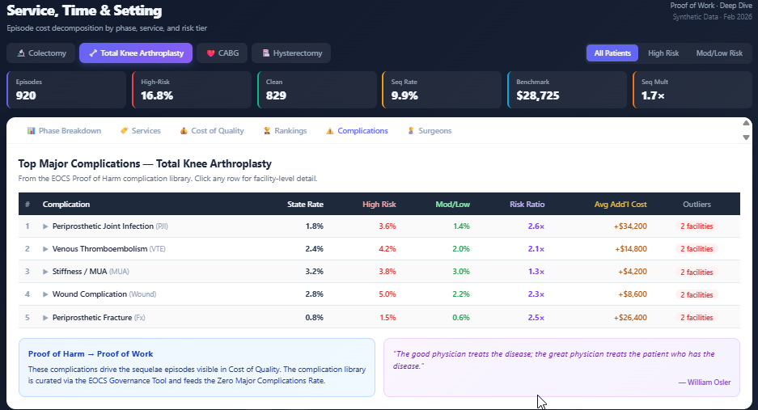

# elixhauser-ahrq

[](https://pypi.org/project/elixhauser-ahrq/)
[](https://opensource.org/licenses/MIT)
[](https://www.python.org/downloads/)
[](https://huggingface.co/datasets/EOCS/elixhauser-icd10-mapping)
[](https://huggingface.co/spaces/EOCS/elixhauser-risk-calculator)

**Python package for AHRQ Elixhauser Comorbidity Index risk adjustment using ICD-10-CM diagnosis codes.**

Maps 4,568 ICD-10-CM codes to 38 Elixhauser comorbidity categories and calculates van Walraven composite scores for mortality and readmission risk. Validated against AHRQ Comorbidity Software Refined for ICD-10-CM (v2026.1). CDC-reviewed.

---

## Installation

```bash
pip install elixhauser-ahrq
```

## Quick Start

```python
from elixhauser_ahrq import ElixhauserMapper, ElixhauserScorer

# Map ICD-10-CM codes to comorbidity categories
mapper = ElixhauserMapper()
patient_dx = ["I509", "E119", "I10", "N183", "E6601"]
flags = mapper.map_patient_diagnoses(patient_dx)

# Calculate van Walraven composite score
scorer = ElixhauserScorer(index_type="mortality")
score = scorer.calculate_score(flags)

print(f"van Walraven Score: {score}")
print(f"Flagged comorbidities: {[k for k, v in flags.items() if v == 1]}")
```

**Output:**
```
van Walraven Score: 7
Flagged comorbidities: ['CHF', 'DiabetesUncomplicated', 'Hypertension', 'RenalFailure', 'Obesity']
```

## Risk Tier Assignment

The van Walraven score maps to risk tiers for population stratification:

| Risk Tier | Score Range | Clinical Profile |
|-----------|-------------|-----------------|
| **Low** | < 0 | Few or no significant comorbidities |
| **Moderate** | 0 to 9 | Modest cumulative comorbidity burden |
| **High** | ≥ 10 | Multiple serious comorbidities or single high-weight condition |

```python
def assign_risk_tier(score):
    if score < 0:
        return "Low"
    elif score <= 9:
        return "Moderate"
    else:
        return "High"

tier = assign_risk_tier(score)
print(f"Risk Tier: {tier}")  # "Moderate"
```

Cut-points are starting recommendations. Validate against your population's observed complication rate gradients and adjust if needed. See the [Risk Stratification Guide](docs/) for methodology.

## API Reference

### `ElixhauserMapper`

Maps ICD-10-CM diagnosis codes to 38 AHRQ Elixhauser comorbidity categories.

```python
mapper = ElixhauserMapper()

# Map a list of diagnosis codes for one patient
flags = mapper.map_patient_diagnoses(["I509", "E119", "I10"])
# Returns: dict with 38 keys, each 0 or 1

# Check a single code
category = mapper.get_category("I509")
# Returns: "CHF" (or None if code doesn't map)
```

### `ElixhauserScorer`

Calculates the van Walraven composite score from comorbidity flags.

```python
# Mortality weights
scorer_mort = ElixhauserScorer(index_type="mortality")
score = scorer_mort.calculate_score(flags)

# Readmission weights
scorer_read = ElixhauserScorer(index_type="readmission")
score = scorer_read.calculate_score(flags)
```

## Use with PACES Episode Grouper

When applied with a [PACES episode grouper](https://www.eocs.ltd), the Elixhauser risk tiers enable stratified episode performance reporting:

- **Claims-based (retrospective):** Score patients after episode completion for facility-level O:E ratio analysis — comparing observed vs. expected zero major complication rates within each risk tier
- **EHR-based (prospective):** Score patients at the pre-operative visit from the active problem list for care planning, shared decision-making, and resource allocation

The risk scoring logic is identical in both contexts. The ICD-10 codes drive the same comorbidity flags and van Walraven weights whether sourced from claims or the EHR.



## 38 Elixhauser Comorbidity Categories

The complete list of categories with their van Walraven mortality weights:

| Category | Weight | Category | Weight |
|----------|--------|----------|--------|
| CHF | +7 | Lymphoma | +9 |
| Cardiac Arrhythmias | +5 | Metastatic Cancer | +14 |
| Valvular Disease | −1 | Solid Tumor w/o Metastasis | +4 |
| Pulmonary Circulation | +4 | Rheumatoid Arthritis | +0 |
| Peripheral Vascular | +2 | Coagulopathy | +3 |
| Hypertension | +0 | Obesity | −4 |
| Paralysis | +7 | Weight Loss | +6 |
| Other Neurological | +6 | Fluid & Electrolyte | +5 |
| Chronic Pulmonary | +3 | Blood Loss Anemia | −2 |
| Diabetes Uncomplicated | −1 | Deficiency Anemia | −2 |
| Diabetes Complicated | +0 | Alcohol Abuse | +0 |
| Hypothyroidism | +0 | Drug Abuse | −7 |
| Renal Failure | +5 | Psychoses | +0 |
| Liver Disease | +1 | Depression | −3 |
| Peptic Ulcer (no bleeding) | +0 | HIV/AIDS | +0 |

*Weights shown are van Walraven mortality weights. Readmission weights differ. See van Walraven et al. (2009) and Moore et al. (2017) for complete weight tables.*

## Versioning

This package tracks AHRQ's annual releases:

| Package Version | AHRQ Version | ICD-10-CM Codes | Status |
|----------------|--------------|-----------------|--------|
| v2026.1 | Elixhauser Comorbidity Software Refined for ICD-10-CM, FY2026 | 4,568 | Current, CDC-reviewed |

When AHRQ publishes updated codes and weights, this package will be updated and a new version released.

## Citation

If you use this package in your work, please cite:

```bibtex
@software{elixhauser_ahrq_2026,
  author = {Opelka, Frank G.},
  title = {elixhauser-ahrq: Python Implementation of the AHRQ Elixhauser Comorbidity Index},
  version = {2026.1},
  year = {2026},
  organization = {Episodes of Care Solutions (EOCS)},
  url = {https://github.com/fopelka-EOCS/elixhauser-ahrq},
  note = {Based on AHRQ HCUP Elixhauser Comorbidity Software Refined for ICD-10-CM. CDC-reviewed.}
}
```

## License & Related Products

### This Package (MIT License)

`elixhauser-ahrq` is **open source** under the MIT License. Free to use, modify, and distribute for any purpose, including commercial use.

This package provides:
- AHRQ Elixhauser Comorbidity Index v2026.1 implementation
- ICD-10-CM to comorbidity category mapping (4,568 codes)
- Risk scoring with AHRQ-validated weights (mortality and readmission)
- Python classes for integration into analytics and AI pipelines

### EOCS Analytics Platform (Commercial License)

For organizations using the PACES episode grouper, **EOCS Analytics** is a separate commercial product that transforms PACES outputs into actionable dashboards.

EOCS Analytics includes:
- dbt transformation models for Snowflake, PostgreSQL, BigQuery, and other databases
- Pre-built dashboard queries (surgeon, facility, payer perspectives)
- Risk stratification using this Elixhauser package
- Complication flagging and sequelae linkage
- O:E ratio calculation with risk-adjusted facility profiling
- Implementation support and documentation

**Key differentiator:** EOCS Analytics runs entirely in YOUR environment. No data leaves your security boundary. No SaaS fees. You own the code.

For licensing information: [fopelka@eocs.ltd](mailto:fopelka@eocs.ltd) | [www.eocs.ltd](https://www.eocs.ltd)

## Attribution

This package uses reference data from the Agency for Healthcare Research and Quality (AHRQ) Healthcare Cost and Utilization Project (HCUP). AHRQ HCUP tools are provided for public use.

For more information: https://hcup-us.ahrq.gov/toolssoftware/comorbidityicd10/comorbidity_icd10.jsp

## References

- Elixhauser A, Steiner C, Harris DR, Coffey RM. Comorbidity measures for use with administrative data. *Medical Care* 1998;36(1):8–27.
- van Walraven C, Austin PC, Jennings A, Quan H, Forster AJ. A modification of the Elixhauser comorbidity measures into a point system for hospital death using administrative data. *Medical Care* 2009;47(6):626–633.
- Moore BJ, White S, Washington R, Coenen N, Elixhauser A. Identifying increased risk of readmission and in-hospital mortality using hospital administrative data: the AHRQ Elixhauser Comorbidity Index. *Medical Care* 2017;55(7):698–705.
